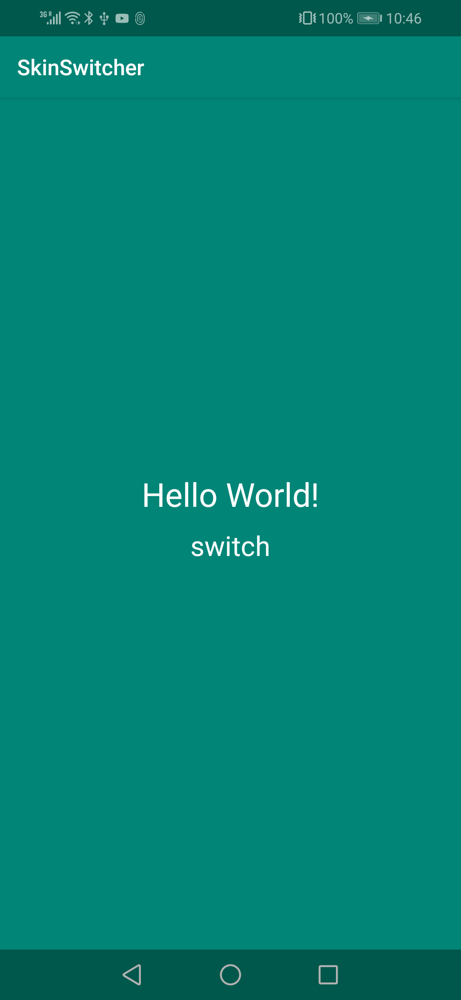
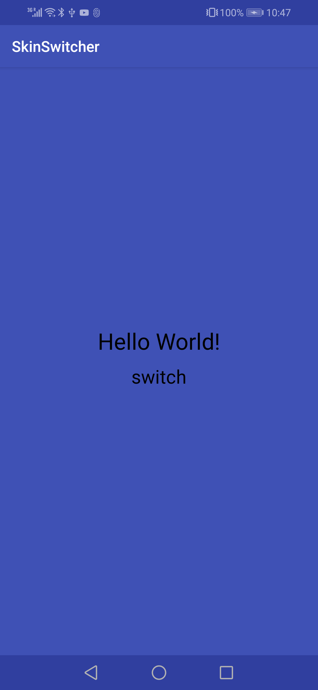

## Preview

Day mode


Night mode



## Usage

### 1. Create color resource
Create `colors.xml` in res/values folder representing the day mode colors.
Create `colors.xml` in res/values-night folder as well representing the night
mode colors.

### 2. Extends `SkinActivity`
Inherit `SkinActivity` and override `openSkin` method to return true
```
public class MainActivity extends SkinActivity{

    @Override
    public boolean openSkin() {
        return true;
    }
}
```

### 3. Call setSkinMode to switch the skin
Inside SkinActivity, `setSkinMode` method is provided to switch the skin
```
setSkinMode(AppCompatDelegate.MODE_NIGHT_YES)

setSkinMode(AppCompatDelegate.MODE_NIGHT_NO)
````
